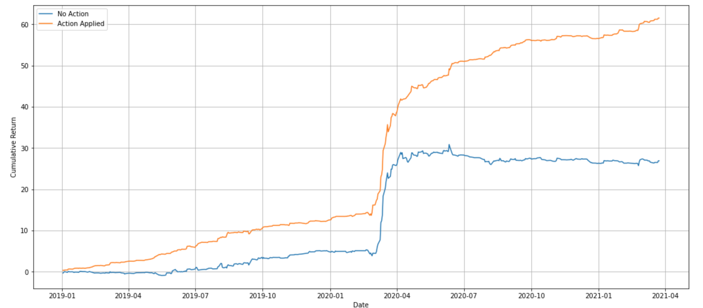

# SignatureModelling: A Regression of target market returns onto the path signature of a time-series of correlated market prices

Given a specific target market (e.g. stock_1) we generate a multi-channel time series of markets believed to be correlated with the target market. For example, given stock_1, we produce a time series monitoring the previous X days of NASDAQ, S&P500 and VIX prices. From this time series we construct a continous path by linear interpolation and from this path, we compute its truncated signature transform: a transformation that allows us to reduce the time series into a fixed number of features. 

Using these features we use an XGBRegressor to model the signature features onto the return of a specific trade having been made many times in the past. If the model predicts a positive return, we make the trade, and if a negative return is predicted, the trade is inverted. We apply the action predicted by the model to the inverted trade. For example, the model could predict an action of -1 meaning we would invert the trade. This would then be multiplied by the actual historical return to generate a return given the model action.

When backtested on a period of two years, the model significantly outperforms the original trades made, with a sharpe ratio of 5.68 relative to the original returns.

Below is the portfolios performance with the models actions applied, compared to the return with no action applied

